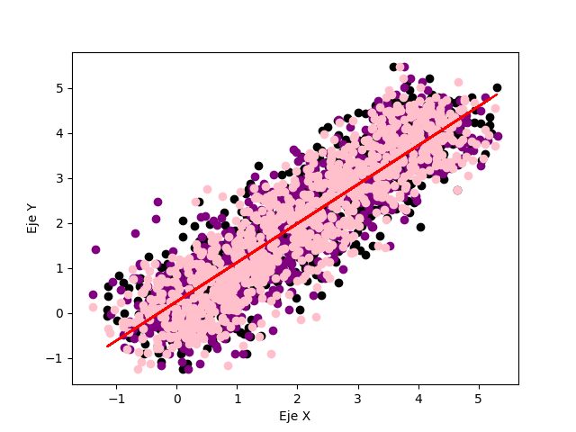
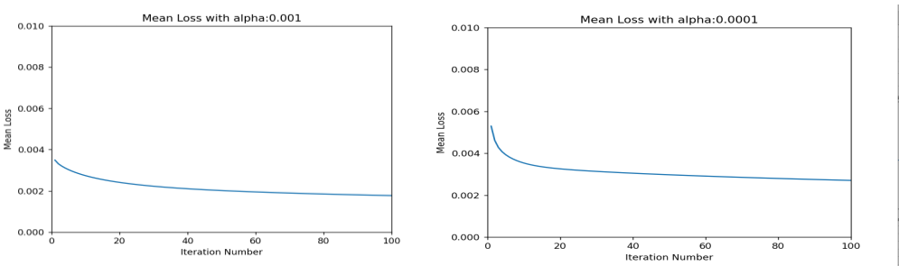

# Informe del Proyecto I - CI5438

#### Elaborado por Jorge Correia y Luis Parra

## Implementación - Parte 1

Se implementó la función de descenso de gradiente para la regresión lineal multivariada, usando como condiciones de convergencia:
- Un número de iteraciones fijo
- Que la función de pérdida cuadrática sea menor a un $\epsilon$ definido pequeño.

Se usó la función dada en clase para el caso multivariado. La regresión lineal usada viene definida por: $h_w(x) = w_0+w_1 \cdot x_1 +  w_2 \cdot x_2$.

La función de pérdida cuadrática usada fue $L^2(y,\hat{y}) = (y - \hat{y})^2$, de acuerdo al enunciado del proyecto. 

Dentro del código se definió que la condición de convergencia para las iteraciones fuera de $50.000$ iteraciones, un $\alpha = 0.000001$ y $\epsilon = 0.463$ con un seed fijo. Si se quita el seed fijo, los valores oscilaban entre $0.47$ y $0.51$ cuando disminuía el error, sin tener muchos cambios cuando alcanzaba la convergencia.

La función definida para hacer las pruebas fue $f(x) = w_0+w_1 \cdot x_1+w_2 \cdot x_2$

Se observa que la línea recta está aproximadamente en el medio de todos los puntos, siendo una regresión lineal que aproxima a la mayoría de los valores dados.

En la gráfica se observa la convergencia del error hacia las 13000 iteraciones, precisamente en el valor $n = 13.476$, con un $\epsilon = 0.462999$

## Parte 2 - Preprocesamiento de los datos

Los datos a ser procesados provienen del dataset `CarDekho.csv`. Este dataset está compuesto por diferentes datos sobre automóviles, y se quiere predecir el atributo *Precio* de un automóvil. Se sugirió usar los atributos de entrada:

- Make
- Year
- Kilometer
- Fuel Type
- Transmission
- Owner
- Seating Capacity
- Fuel Tank Capacity

Estos atributos serían las columnas de datos, si bien, existen otros factores que podrían ser influyentes como el torque y la fuerza, no conseguimos una manera correcta de representar ambos números, por otra parte, definirlos como variables categóricas no era viable dada la gran cantidad de variables que surgirían por tomar esta acción. Para los casos de *Make*, *Transmission*, *Seating Capacity*, *Fuel Type* y *Owner* se subdividió en variables dummy, es decir, variables dicotómicas que pueden tomar valores 1 o 0, siendo una variable nueva cada una de los elementos únicos de Make.

En el caso de *Seating Capacity* se optó por modelarlo como una variable categórica y no contínua, dado que son pocas opciones y solo puede adoptar valores enteros positivos, en el dataset estaba subdivido de 2 a 8.

Para los valores numéricos como *Kilometer*, *Price*, *Fuel Tank Capacity* y *Year* éstos fueron parametrizados, para no tener que trabajar con datos númericos extremadamente altos, principalmente *Kilometer* y *Price*.

Y finalmente para manejar los valores faltantes se decidió utilizar la moda como dato por defecto para que no afectara de sobremanera a la información.

Además de esto se eliminaron los siguientes elementos que se consideraban atípicos:

- Kilometrajes de 2 millones y 950 mil
- Tipos de combustible que solo tenían 1 o 2 casos como *CNG+CNG*,*PETROL + CNG* y *PETROL + LPG*
- Owner se eliminó el caso de *4 or more* ya que no tenía casos significativos.

Podemos observar ciertos ejemplos de casos donde hubo valores atípicos:

#### Fuel Tank Capacity

El diagrama de caja del atributo *Fuel Tank Capacity* se puede observar que la mayoría de los carros tienen sus valores entre 40 y 60 Litros, pero hay datos atípicos que superan los 85L.

#### Year

El caso del atributo *Year*, se observa que la mayoría de los carros datan de entre el 2014 al 2019, pero nuevamente se observan puntos de vehículos previos al 2006, e inclusive un carro de 1988.

#### Kilometer

Este diagrama de caja muestra la distancia recorrida por el carro, donde un carro 0Km representa un carro nuevo. El kilometraje varía entre 20000 a 100000Km

Y en más detalle, los comportamientos en este histograma:

## Parte 3 - Entrenamiento del modelo

En el siguiente cuadro podemos observar diferentes valores para $\alpha$ (Tasa de Aprendizaje) que se utilizaron, en conjunto de las mismas condiciones para medir el comportamiento. Podemos observar el valor que aprende más rápido es 0.001, siendo que tiene el mejor rendimiento del resto. Le sigue es 0.0001 un poco más atrás, ya de ahí en adelante la tasa de aprendizaje es extremadamente baja y tarda mucho en aprender. Se probó también con 0.1, pero esto causaba un overflow ya que era muy grande. Por lo que el punto ideal debe rondar entre 0.01 y 0.001.

Cabe acotar que los tiempos por iteraciones eran alrededor de 1-2 segundos, por lo que se probaron con una cantidad de tiempo comprensibles, esto capaz se deba a que se está utilizando Python puro y no se emplearon librerías como *numpy* para agilizar el procesamiento de la información.

 | Iteraciones/$\alpha$ | 0.001 | 0.0001 | 0.00005 | 0.00001 |
  :-----------: |------|-------|-----------|-------- |
 | 100 | 3.118280139 | 4.389778897 | 4.685985727 | 5.992504547|
 | 300 |2.327452545 | 2.985638202| 4.430267141 | 5.275937336 |
 | 500 | 2.177081523| 3.479149128 | 4.173399578 |  5.229644753|
 | 1000| 1.886570943| 3.114268318| 3.564708046 | 4.133306292|

Veremos en detalle las gráficas con la pérdida y la pérdida media para cada grupo de iteraciones:

#### Caso de 100 iteraciones
Pérdida para $\alpha$ 0.001 y 0.0001

Pérdida para $\alpha$ 0.00001 y 0.00005

Pérdida media para $\alpha$ 0.001 y 0.0001

Pérdida media para $\alpha$ 0.00001 y 0.00005

#### Caso de 300 iteraciones
Pérdida para $\alpha$ 0.001 y 0.0001

Pérdida para $\alpha$ 0.0001 y 0.0005

Pérdida media para $\alpha$ 0.001 y 0.0001

Pérdida media para $\alpha$ 0.00001 y 0.00005

#### Caso de 500 iteraciones
Pérdida para $\alpha$ 0.001 y 0.0001

Pérdida para $\alpha$ 0.0001 y 0.0005

Pérdida media para $\alpha$ 0.001 y 0.0001

Pérdida media para $\alpha$ 0.00001 y 0.00005

#### Caso de 1000 iteraciones
Pérdida para $\alpha$ 0.001 y 0.0001

Pérdida para $\alpha$ 0.0001 y 0.0005

Pérdida media para $\alpha$ 0.001 y 0.0001

Pérdida media para $\alpha$ 0.00001 y 0.00005

### Hipótesis

Para nuestra hiṕotesis, seleccionamos:
-  Tasa de aprendizaje $\alpha = 0.001$
-  Tiempo de ejecución: aproximadamente 1 hora
-  Tiempo por iteración: alrededor de 1-2 segundos
-  Número de iteraciones: 5000

Con estos valores, la ejecución convergiendo lentamente, vemos que de la iteración 1000 a la 5000 no hay un cambio tan significativo, pero sigue bajando la pérdida, lo que podemos concluir que es posible que haya una convergencia con una mayor cantidad de iteraciones más adelante, así como realizar optimizaciones de tiempo para que sea más rápido ejecutar un numero de épocas o iteraciones muchísimo más grandes.